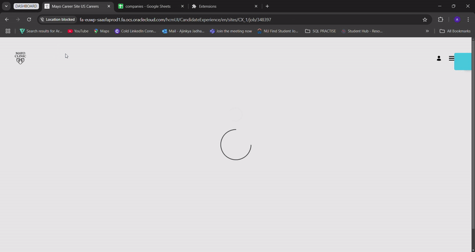

# 🚀 Job Tracker: Empower Your Career Journey

---

## 📝 Overview
**Job Tracker** is your smart assistant for simplifying the job application process. As a **Chrome Extension**, it streamlines the tedious task of collecting job details, and aligning your resume with industry trends. Built as an MVP, this extension empowers job seekers to **save time**, **analyze opportunities**, and **gain insights** to secure their dream roles.

---

## 💡 Problem Statement
Navigating through countless job postings is overwhelming, and tailoring resumes for each application can be daunting. Job seekers often miss opportunities because:
- Manual tracking of job details is inefficient.
- Insights about market trends remain untapped.

---

## 🎯 Our Solution
**Job Tracker** automates the grunt work:
1. **Extract Details**: Automatically captures job titles, company names, and descriptions from any job board.
2. **Google Sheets Integration**: Allows users to save and organize job details in their **own custom sheets**.
3. **Popup Dashboard**: View relevant keywords and insights in a sleek, intuitive interface.

---

## 🛠️ What We Built
As part of our MVP:
- **Chrome Extension (Manifest V3)**:
  - Built using **JavaScript**, **HTML**, and **CSS**.
  - Dynamic content and background scripts for seamless operation.
- **Smart Extraction Engine**:
  - Uses DOM parsing and heuristics to fetch job descriptions from popular platforms like LinkedIn and Glassdoor.
- **Google Sheets API Integration**:
  - Enables users to save and track job details in a spreadsheet.
- **Notifications**:
  - Alerts users upon successful keyword extraction and data saving.

---

## 🌟 Features
### Current MVP:
- **Job Details Extraction**: Automatically fetch job titles, company names, and descriptions from postings.
- **User Integration**: Configurable Google Sheets endpoint for personalized job tracking.
- **Interactive Popup**: View and manage keywords directly in your browser.
- **Secure and Scalable**: Built with Chrome security standards and user-first design principles.

### Next Steps:
- **Enhanced Platform Support**:
  - Expand compatibility with job boards like Indeed, Monster, and more.
- **Keyword Recommendation**:
  - Suggest resume edits based on extracted keywords.
- **Analytics Dashboard**:
  - Provide visual insights into job trends, keyword frequency, and market demands.
- **Custom Notifications**:
  - Enable alerts for high-priority job listings or keyword matches.
- **AI-Powered Resume Builder**:
  - Seamlessly integrate keywords into tailored resumes.

---

## 🚀 How It Works
1. **Install the Extension**: Add Job Tracker to your Chrome browser.
2. **Setup Google Sheets**:
   - Create a Google Sheet and deploy a Web App using Apps Script.
   - Configure the Web App URL in the extension settings.
3. **Extract Job Details**:
   - Navigate to a job listing and let the extension extract details.
4. **Analyze Keywords**:
   - Open the popup to view relevant keywords and save them.

---

## 🖥️ Demo
> Placeholder for a GIF demonstration. Add a GIF here showing the extension in action.
> Example:
> 

---

## 📂 File Structure
